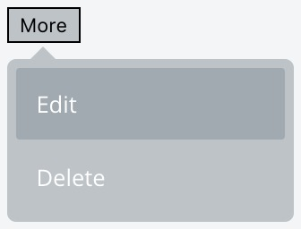

# drop
💧 Pure SCSS drop. Themeable.

## How To Use

The minimal drop HTML markup looks like this:

```html
<div class="drop drop--down"> <!-- 1 -->
 <!-- 2 -->
 <div class="drop__content"> <!-- 3 -->
   <!-- 4 -->
 </div>
</div>
```

1) This element enables the drop functionality. There are other CSS classes
   that one can utilize:

- `drop--up`         => reverses the direction of drop
- `is-open`          => activates the drop programatically
- `-color-secondary` => inverts the color scheme
- `-color-lighter`   => lightens the default color scheme

2) Virtually any element, be it a block or an inline element,
  can be used in this place.

3) Main content holder. There are more classes to use here:
- `-transition-fade-in`  => adds an animated transition
- `-transition-slide-in` => adds an animated transition

4) Virtually any element can go here but if you want a popover
  with a nice arrow you want to insert the following markup:

  ```html
  <div class="drop-arrow"></div>
  <div class="drop-list -size-medium -position-left"> <!-- 5 -->
    <button class="drop-list__btn">Action 1</button>
    <button class="drop-list__btn">Action 2</button>
  </div>
  ```

5) There are some more CSS class options here:

- `-pull-left` or `-pull-right`           => pulls the content to the side a bit
- `-position-center` or `-position-right` => changes the position of the content
- `-border-rounded`                       => rounds the content holder borders

## Preview

Dark


Light



## Example

```html
<div class="drop -color-lighter drop--down">
  <button class="more">More</button>

  <div class="drop__content -transition-slide-in">
    <div class="drop-arrow"></div>

    <div class="drop-list -size-medium -position-right -border-rounded">
      <button class="drop-list__btn">Edit</button>
      <button class="drop-list__btn">Delete</button>
    </div>
  </div>
</div>
```

## License

See the [LICENSE](LICENSE)
